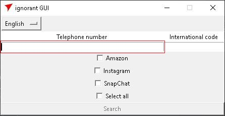
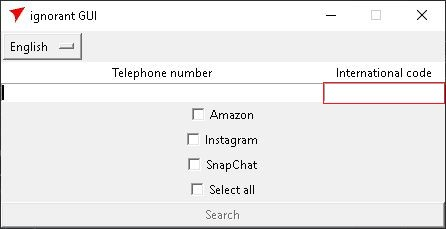
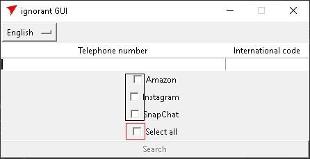
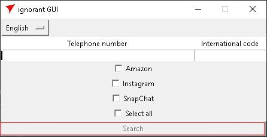

# Ignorant_gui

## Table of contents
* [General info](#general-info)
* [Licence](#licence)
* [Perequisite](#perquisite)
* [Main libraries used](#main-libraries-used)
* [Installation](#installation)
* [How to use](#how-to-use)


## General info


A simple gui for Ignorant from [Megadose](https://github.com/MegaDose). Uses phonenumbers from [nyaruka](https://github.com/nyaruka) and [tkinter](https://wiki.python.org/moin/TkInter)

## Licence
[GNU General Public Licence v3](https://www.gnu.org/licenses/gpl-3.0.html)
## Perquisite
[Python3](https://www.python.org/downloads/release/python-370/)-7 or higher

## Main libraries used

* [Ignorant](https://github.com/megadose/ignorant)
* [phonenumbers](https://github.com/nyaruka/phonenumbers)
* [tkinter](https://wiki.python.org/moin/TkInter)

## Installation

### With GitHub

```
git clone https://github.com/NycoOfAshes/Ignorant_gui
cd Ingnorant_gui
python3 -m install -r requirements.txt
```

### Launch

```
python3 main.py
```

## How to use

#### Imput a phone number


#### Imput an international code


#### Select a site where testing the phone number, or select all to check in all sites


#### Then push on the search button (activated once you fill all entries and select at least one site)


#### It displays all positive results. Only one here. The phone number is displayed instead of "phone number"
